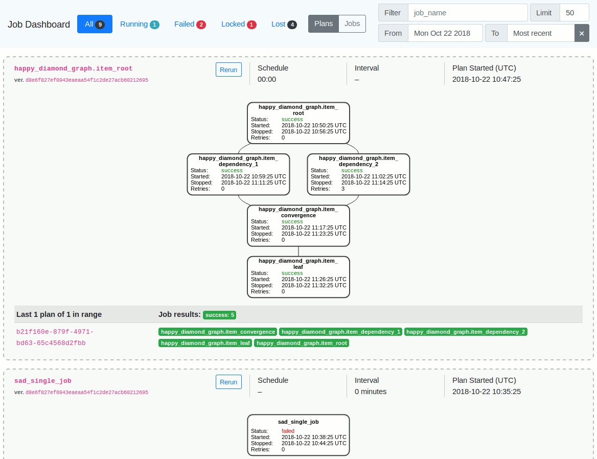

# ephyra

Generic DAG Jobs Dashboard.




## Prerequisites

You will need [Leiningen][1] 2.0 or above installed.

[1]: https://github.com/technomancy/leiningen

## Development

    $ rlwrap lein figwheel

    $ lein repl

    user=> (start)     ; Server
    user=> (start-fw)  ; Figwheel; better start it independently.


### Postgres

    CREATE USER ephyra WITH PASSWORD 'ephyra';
    ALTER ROLE ephyra WITH LOGIN;
    CREATE DATABASE ephyra_dev;
    CREATE DATABASE ephyra_test;
    GRANT ALL ON DATABASE ephyra_dev, ephyra_test to ephyra;

After executing these commands, the command below should succeed.

    $ sh -c 'export PGPASSWORD=ephyra; psql --host localhost -U ephyra ephyra_dev -c "SELECT 1337 AS it_works"'

To customise, see profiles.clj.

## Migrations

    $ lein migratus

    $ lein migratus rollback


    $ lein repl
    user=> (migrate)
    user=> (rollback)


## Running

OpenJDK 8 is recommended. 9 may still run but above that Leiningen won't even start.

To start a web server for the application, run:

    $ lein run

Kafka consumer:

    $ lein run consumer


## Input data

Input is specified by specs in ephyra.jobs.persistence. Examples in resources/samples/events.

## Mock data

    $ lein repl
    user=> (migrate)
    user=> (load-sample-events)

Another way is to send and receive events over Kafka from your job executor.


# Configuration

When running a compiled uberjar, following env vars are required:

    export DATABASE_URL="postgresql://localhost/ephyra_dev?user=ephyra&password=ephyra"
    export KAFKA_SERVER="localhost:9092"  # Only for the consumer.
    export EXECUTOR_RUN_JOB_URL="http://localhost:5000/run_plan"
    export EXECUTOR_RUN_PLAN_URL="http://localhost:5000/run_plan"


## Deployment

    SENTRY_DSN=...(check: https://sentry.io [optional])

### Cloud SQL

Since JDBC cannot connect to Unix sockets on its own, you can use the trainwreck of a SocketFactory
to connect to Cloud SQL Proxy Unix sockets:
https://github.com/GoogleCloudPlatform/cloud-sql-jdbc-socket-factory#using

E.g.:
```
CLOUD_SQL_FORCE_UNIX_SOCKET=meh
DATABASE_URL='postgresql:///ephyra?user=ephyra&password=<XXX>&socketFactory=com.google.cloud.sql.postgres.SocketFactory&socketFactoryArg=<PROJECT_ID>:<REGION>:<DB_NAME>'
```

Limitations:

- The path Cloud SQL sockets must be mapped to is hardcoded to /cloudsql by the library.
- We have to set `CLOUD_SQL_FORCE_UNIX_SOCKET` (previously `GAE_RUNTIME`) to something nonblank so
  the library doesn't try to connect via SSL instead.


## License

See LICENCE.

Copyright © 2016-2018 Infectious Media
Copyright © 2018- Infectious Media and Contributors
